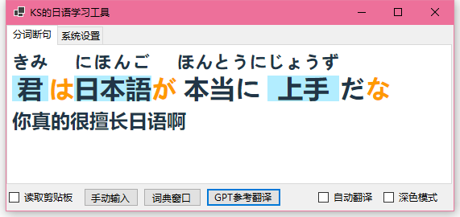

# ja-learner




## 介绍

JA-Learner 是一款简单、轻便、实用的日语学习工具，集成了基于 MeCab 的汉字注音、语法分析功能，以及基于 GPT 的翻译功能。

本软件主要有以下特性：

- 对输入的日语进行分词、注音，使用不同颜色显示不同词性的单词，使句子更加清晰易读。

- 哪里不会点哪里，点击单词快速查询 MOJi 辞書。

- 调用 GPT 接口翻译句子、解说句子的单词和语法成分。

- 吸附其它窗口、读取剪贴板实时更新文本，配合游戏文本提取工具，提升游戏文本的阅读体验。

## 使用

### 窗口吸附

在主窗口的“系统设置”面板中，首先点击“选择窗口”按钮，然后把鼠标移到想要吸附的窗口，点一下左键。此时右边选框中的文字会变“与 xxx 对齐”，把选框勾上，窗口就吸附到游戏窗口边上了。


### 游戏文本提取

本软件**并没有**内置的游戏文本提取的功能，但是可以实时读取剪贴板。建议使用 [Textractor](https://github.com/Artikash/Textractor)、[manga-ocr](https://github.com/kha-white/manga-ocr) 等文本提取工具将游戏文本提取至剪贴板，然后在本软件中勾选“读取剪贴板”，即可实时同步游戏文本。


### 使用 GPT（需要 API KEY）

在 `config.txt` 的第一行输入 API KEY，第二行输入 API URL。

如果你使用官方 API，那么 `config.txt` 中的内容应该是这样的：

```
sk-xxxxxxxxx
https://api.openai.com/{0}/{1}
```

如果你使用第三方反代，就要将第二行修改为相应的域名。

配置好 API KEY 就可以使用 GPT 翻译和解说文本了：


## 声明

### 分析与翻译仅供参考

无论是基于 MeCab 的分词、注音，还是基于 GPT 的翻译、解析，都无法保证 100% 的准确率。

比如 MeCab 经常把应该读成「からだ」的「身体」注音成「しんたい」，人名的读音基本乱标（这倒也正常，后续可能会添加自定义词典功能解决这个问题），也会时不时出现一些其它低级错误。

GPT 偶尔也会发癫，比如使用简体中文以外的语言回复、唐突[塞氏翻译法](https://zh.moegirl.org.cn/zh-hans/塞氏翻译法)等等。不过大多数时候还是很靠谱的，在翻译一些俗语、流行语时甚至比谷歌、DeepL 还强一些。

如果遇到可疑的注音，建议点击单词查看 MOJi 词典的解释和注音，或者使用 GPT 的解说功能。如果 GPT 翻译出错，再次点击翻译按钮重新翻译，可能会得到更好（或者更离谱）的翻译结果。

### 本项目使用的第三方库与工具

- 分词、注音：[kekyo/MeCab.DotNet](https://github.com/kekyo/MeCab.DotNet)
- GPT：[OkGoDoIt/OpenAI-API-dotnet](https://github.com/OkGoDoIt/OpenAI-API-dotnet)
- 单词搜索：[MOJi 辞書](https://www.mojidict.com/)
