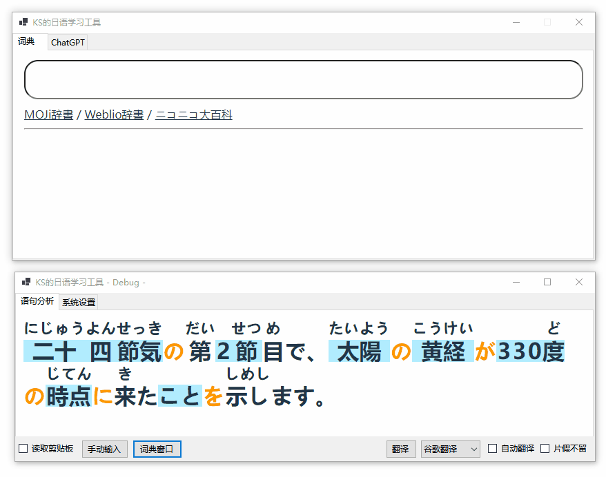

<h1 align="center">KS的日语学习工具 v0.3</h1>
<div align="center">
    <strong>📖 简易日语学习 / 视觉小说阅读辅助工具</strong>
    <br />
    <span>句子拆解 • 汉字注音 • 一键查词 • 参考翻译 • 外来语标注 • AI讲解</span>
</div> 
<h3 align="center">
    <a href="https://github.com/ks233/ja-learner/releases">下载</a><span> • </span><a href="https://github.com/ks233/ja-learner/issues">Bug 反馈</a>
</h3>
<div align="center">
    <a href="https://github.com/ks233/ja-learner">
        
    </a>
</div>


## 功能介绍

* **语句分析**：用不同样式区分句子成分，为句子中的汉字注音
* **单词查询**：点击单词一键查询 MOJi 辞書，哪里不会点哪里
* **参考翻译**：支持谷歌翻译与 ChatGPT 翻译，把握句子整体含义
* **片假不留**：在片假名上方显示英语翻译，满屏片假名也不怕
* **游戏文本分析**：吸附并跟随游戏窗口，配合文本提取工具，实时分析游戏文本
* **AI 讲解**：调用 ChatGPT 讲解句子中的单词和语法成分


## 使用说明

### 分析与查词

* 读取剪贴板或手动输入句子
* 勾选“片假不留”把片假名单词翻译成英文
  * 点击片假名单词上方的英文可以隐藏该单词的翻译，再点一下恢复显示，用于屏蔽错误的翻译结果
* 可以用 Ctrl + 滚轮调整分析界面的显示大小
  * 本质浏览器套壳，你甚至可以按 F12 打开控制台（
* 在语句分析界面点击单词快速查词
  * 左键点击单词：在词典窗口中显示 MOJi 辞書的搜索结果
  * 中键点击单词：在浏览器中打开单词在 MOJi 辞書的搜索页面
  * SHIFT + 左键点击单词：在搜索内容末尾追加该单词
* 词典窗口手动搜索
  * 双击搜索框清空搜索内容
  * 点击链接跳转至对应的词典网站




搜索框与 SHIFT 追加搜索是 v0.3 新增的功能，MeCab 有时候会过度断句，比如把“二十四节气”当成了三个词，“四”的注音还标错了。用追加搜索功能就可以把拆开的词拼回来，使查词更加灵活。


### 窗口吸附

在主窗口的“系统设置”面板中，首先点击“选择窗口”按钮，然后把鼠标移到想要吸附的窗口，点一下左键。此时右边选框中的文字会变成“与 xxx 对齐”，把选框勾上，窗口就吸附到游戏窗口边上了。


### 游戏文本提取

本项目**并没有**内置游戏文本提取的功能，但是可以实时读取剪贴板。建议使用 [Textractor](https://github.com/Artikash/Textractor)、[manga-ocr](https://github.com/kha-white/manga-ocr) 等文本提取工具将游戏文本提取至剪贴板，然后在本软件中勾选“读取剪贴板”，即可实时同步游戏文本。配合 Textractor 的使用效果如图：


### 参考翻译

目前支持了谷歌翻译和 GPT 翻译。其中谷歌翻译无需配置，可以免费无限制使用，而 GPT 需要配置 API Key，消耗 API 余额。

#### 谷歌翻译 & 谷歌生草机

这是两个不同的接口，“谷歌翻译”会得到与网页版谷歌翻译相同的翻译结果，“谷歌生草机”的翻译结果与网页版不同，质量普遍低于网页版。

#### 使用 GPT（需要 API Key）

首先要配置 api key，在 `appsettings.json` 中配置 ApiKey 与 ApiUrl：

```
"ApiKey": "sk-xxx",
"ApiUrl": "https://api.openai.com/{0}/{1}",
```

如果你使用官方 API，就不用修改 ApiUrl，如果使用第三方反代，就要将其修改为相应的域名。

配置好 ApiKey 就可以使用 ChatGPT 翻译和解说文本了。


### 沉浸模式

- 双击分析页面的背景，进入仅显示语句分析的沉浸模式
- CTRL + 左键拖动窗口
- 左键拖动窗口边缘调整窗口大小


## 使用建议

本项目的分词与注音功能基于 MeCab，虽然整体准确率还算可以，但有时会犯一些低级错误，比如在某些语境下把<ruby>身体<rt>からだ</rt></ruby>注音为 しんたい、把<ruby>二人<rt>ふたり</rt></ruby>注音为 ににん，遇到读音特殊的人名也无法正确注音。用词汇更丰富的 [UniDic](https://clrd.ninjal.ac.jp/unidic/) 词典替换 `dic` 文件夹中默认的 IPADIC 效果会稍好一些。

翻译毕竟都是机翻，准确率有限。谷歌翻译遇到复杂的句式和不规范的表达就容易翻车，ChatGPT 比谷歌懂更多俗语、流行语，但比较不稳定，偶尔会使用简体中文以外的语言回复、唐突地使用[塞氏翻译法](https://zh.moegirl.org.cn/zh-hans/塞氏翻译法)。建议把本软件当做一个精读工具而不是翻译器，把注意力放在日语原文上，只在不确定的时候使用翻译作为参考。

外来语标注功能使用谷歌翻译将片假名单词翻译为英语，但不是所有片假名单词都是外来语，外来语也不一定来源于英语，还有像 supplies 和 surprise 这样的“同音词”也不好区分，因此也会出现标注错误的情况。

根据作者自己的使用体验，整体准确率还可以接受，但还是不建议完全初学者使用，以免被误导。如果遇到可疑的注音或翻译，建议查询更权威的词典，比如 [Weblio 辞書](https://www.weblio.jp/)、大辞林、小学馆日中，网络用语可以查 [ニコニコ大百科](https://dic.nicovideo.jp/)。

## 相关项目

开坑的想法主要来源于 [YUKI 翻译器](https://github.com/project-yuki/YUKI) 和 [Translation-Aggregator](https://github.com/Translation-Aggregator/Translation-Aggregator)，前者支持了丰富的翻译接口，内置了文本提取功能，但使用起来比较复杂，且缺少快速查词的功能；后者虽然可以鼠标悬停查词，但只有日英词典、界面比较古老，而且翻译接口几乎炸完了，于是我决定搓一个更简单、更符合自己需求的工具。

使用的第三方工具与参考资料：

* 形态分析：[taku910/mecab](https://github.com/taku910/mecab) 的 .Net 移植版本 [kekyo/MeCab.DotNet](https://github.com/kekyo/MeCab.DotNet)
* ChatGPT：[OkGoDoIt/OpenAI-API-dotnet](https://github.com/OkGoDoIt/OpenAI-API-dotnet)
* [前端页面](https://github.com/ks233/ja-learner-webview)：[WebView2 控件](https://www.nuget.org/packages/Microsoft.Web.WebView2)，Vite + Vue
* 单词搜索：[MOJi 辞書](https://www.mojidict.com/)
* 谷歌翻译：参考了 [FilipePS/Traduzir-paginas-web](https://github.com/FilipePS/Traduzir-paginas-web) 的 API 调用方式
* 其它参考资源：[taishi-i/awesome-japanese-nlp-resources](https://github.com/taishi-i/awesome-japanese-nlp-resources)

## 贡献者

<!-- ALL-CONTRIBUTORS-LIST:START - Do not remove or modify this section -->
<!-- prettier-ignore-start -->
<!-- markdownlint-disable -->

<table>
  <tbody>
    <tr>
      <td align="center" valign="top" width="14.28%"><a href="https://ks233.github.io/"><br /><sub><b>ks233</b></sub></a><br /><a href="#code-ks233" title="Code">💻</a></td>
      <td align="center" valign="top" width="14.28%"><a href="https://github.com/shaka0919"><br /><sub><b>Harvey Wang</b></sub></a><br /><a href="#code-shaka0919" title="Code">💻</a></td>
      <td align="center" valign="top" width="14.28%"><a href="http://lgbt.sh"><br /><sub><b>跨性别</b></sub></a><br /><a href="#infra-ly-nld" title="Infrastructure (Hosting, Build-Tools, etc)">🚇</a></td>
    </tr>
  </tbody>
</table>

<!-- markdownlint-restore -->
<!-- prettier-ignore-end -->

<!-- ALL-CONTRIBUTORS-LIST:END -->
